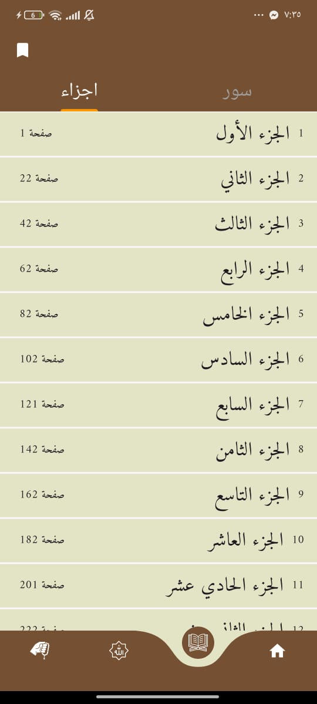
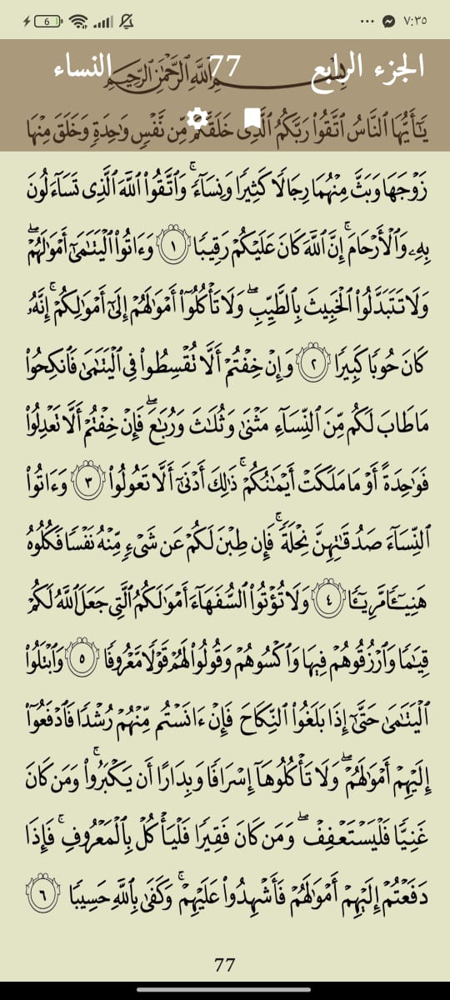
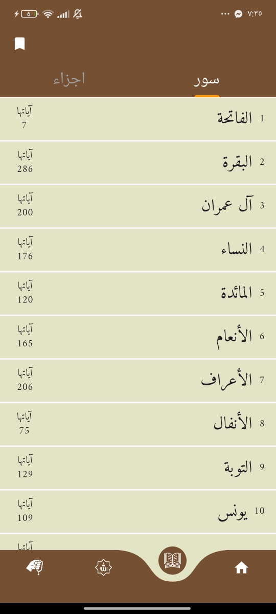
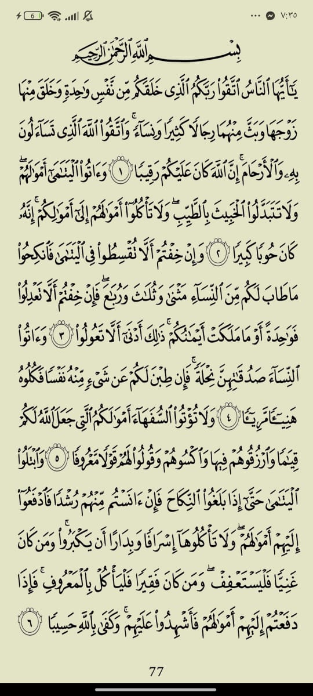
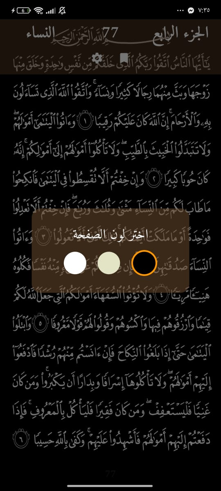
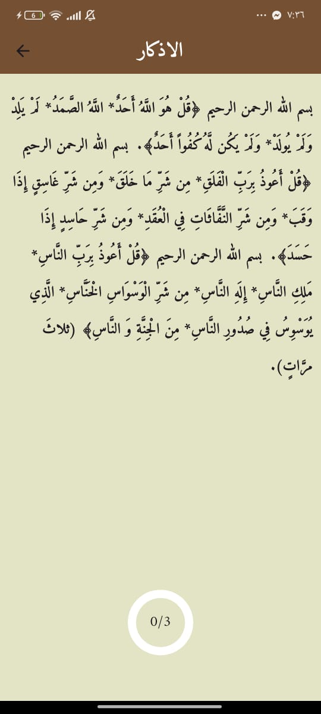
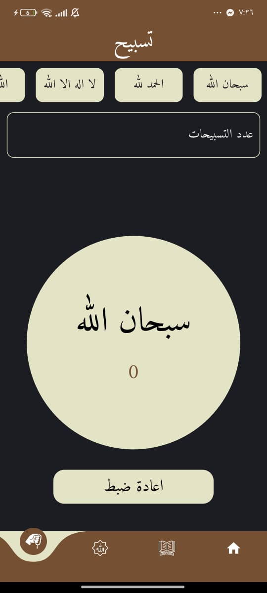
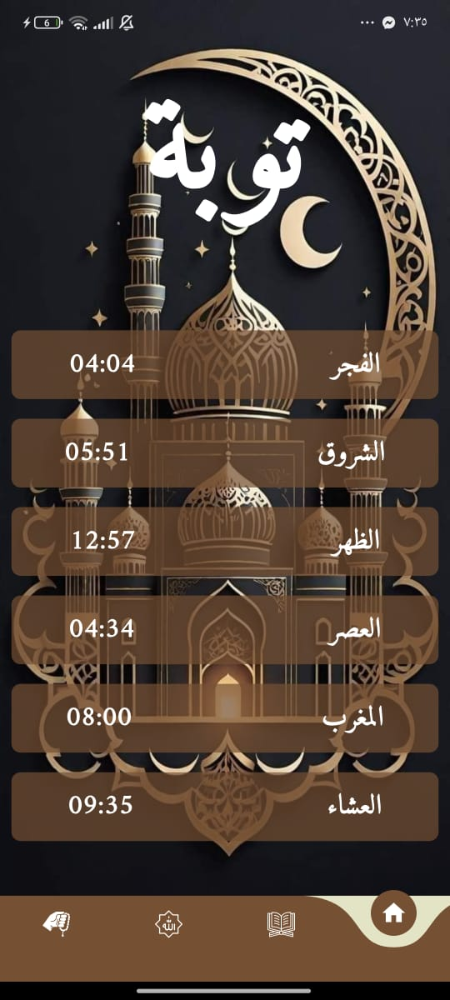

# 📖 Toba App

Toba is an Islamic app built with **Flutter** that helps Muslims in their daily worship.  
It provides **Quran reading**, **Azkar (remembrances)**, **Tasbih counter**, and **Prayer times** based on the user's location.  

---

## ✨ Features

- 📖 **Holy Quran** – Read the Quran with smooth navigation.  
- 🤲 **Azkar** – Morning , evening Azkar and more to stay connected with Allah.  
- 📿 **Tasbih Counter** – Digital tasbih for dhikr.  
- 🕌 **Prayer Times** – Accurate prayer times based on location.  
- 📍 **Location-based services** – Uses device GPS to calculate prayer times.  
- 🌙 **Responsive UI** – Works on mobile and tablets.  

---

## 🛠️ Tech Stack

- **Flutter** – Cross-platform mobile development  
- **Dart** – Programming language  
- **Cubit (BLoC)** – State management  
- **Shared Preferences** – Local storage for user data  
- **Geolocator** – Fetch user location to calculate prayer times  

---

## 📸 Screenshots

### 🏠 Home & Quran
<p float="left">
  
  
  
  
  


</p>

### 🤲 Azkar & Tasbih
<p float="left">
    
  
  

</p>

### 🕌 Prayer Times
<p float="left">
  
</p>

---

## 🚀 Getting Started

1. Clone the repository:
   ```bash
   git clone https://github.com/yourusername/toba.git
